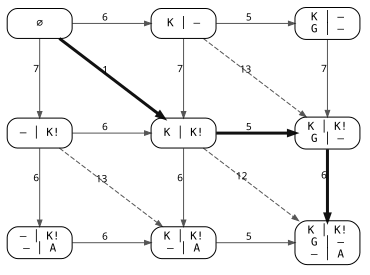

## Abstract

Diffs are commonly presented as patches - lines to add or remove from a source
file to result in a target file. For humans, this presentation isn't always easy
to follow - often diffs can be more intuitively presented 'side-by-side' - where
the source file is shown on the left, and the target file on the right. This
presents an interesting problem of deciding which changed lines to display
together. This paper models that decision as the shortest path through a
weighted directed acyclic graph of line-sequence prefixes. Removal, addition and
pairing form the graph's edges, and dynamic programming finds the minimum-cost,
order-preserving alignment. This gives a global optimisation for a given cost
model; explicit heuristics are defined to reject lines whose character
similarity would produce unintuitive matches. Cheap lower bounds and a banded
inner dynamic programme avoid unnecessary edit-distance computation. The
resulting method makes line pairing a global decision while still leaving
unrelated lines apart. An extension is presented that uses the same pairwise
alignment to give an alignment for a three-way diff.

## Problem statement

A line diff tells us which text survived and which text changed. That is enough
for a patch, but for a side-by-side presentation there's a further choice to
make: which changed line on the left belongs beside which changed line on the
right?

While that sounds like a small piece of layout work, it is a surprisingly
complex problem. A changed region with $m$ lines on one side and $n$ on the
other has one possible alignment for every path through an $m$ by $n$ grid, and
that number grows exponentially with the size of the region. The choices also
have visible consequences. A poor alignment can make one edit look like several,
or imply a relationship between two lines which happen to contain similar
characters but say entirely different things.

What makes the problem particularly interesting is the split in the solution.
The graph and dynamic programme give an exact optimum for a chosen cost model.
The cost model captures the human judgement: when does putting two lines
together clarify the change?

Consider this small change:

| Before | After |
|---|---|
| <pre>Kermit opens the show  Fozzie tells a joke Gonzo fires the cannon</pre> | <pre>Tonight, Kermit opens the show Statler heckles from the balcony Fozzie tells a terrible joke Gonzo fires the cannon</pre> |

The first row is clearly one edited line. The empty cell belongs to Statler's
insertion. Fozzie's joke has been edited too, while Gonzo provides an exact
match at the end. Pairing by position gets this wrong as soon as Statler starts
heckling: every later line is shifted. Pairing only exact matches also misses
the relationships between the two edited lines.

There is a less obvious failure at the other extreme. Given `Miss Piggy enters
gracefully` on one side and `Animal attacks the drums` on the other, forcing the
two lines into alignment results in an unintuitive diff (and probably an
argument backstage). A good alignment would leave both lines unpaired.

The problem is therefore to find an order-preserving alignment of two line
sequences. Each output row consumes a line from the before sequence, the after
sequence, or both. It must consume every input line exactly once, never change
the order of either sequence, and should pair lines only where doing so improves
readability.

This is a global optimisation problem. A plausible match near the start can
steal a line from a much better match later, so a greedy walk is insufficient.
This naturally lends itself to a graph traversal problem.

## The alignment graph

Let the before lines be

$$B = (b_1, b_2, \ldots, b_m)$$

and the after lines be

$$A = (a_1, a_2, \ldots, a_n).$$

Create a vertex $(i,j)$ for every pair of prefixes. The vertex means that the
first $i$ before lines and the first $j$ after lines have been consumed. There
are three possible outgoing steps:

| Step | Edge | Meaning |
| --- | --- | --- |
| Remove | $(i,j) \rightarrow (i+1,j)$ | Put $b_{i+1}$ on a row by itself |
| Add | $(i,j) \rightarrow (i,j+1)$ | Put $a_{j+1}$ on a row by itself |
| Pair | $(i,j) \rightarrow (i+1,j+1)$ | Put the two next lines on one row |

Every edge increases $i+j$, so the graph is a directed acyclic graph (DAG). More
importantly, every legal alignment is a path from $(0,0)$ to $(m,n)$, and every
such path describes a legal alignment. By giving the edges costs, the alignment
problem becomes a shortest-path problem.

For a small example, let the before side contain `Kermit` and `Gonzo`, and the
after side contain `Kermit!` and `Animal`. The nodes use `K`, `G`, `K!`, and `A`
respectively as abbreviations for those lines. Each node shows the cheapest
partial alignment for the lines consumed at that point. The before and after
sides are separated by a vertical line; a dash means that the line on the other
side is unpaired. $\varnothing$ represents the empty alignment at the start. The
cost function used to assign weights to each edge is described in detail in
subsequent sections.

*Figure 1: Alignment graph for two lines on each side. Moving right consumes a
before line, moving down consumes an after line, and moving diagonally pairs the
two. Every edge is labelled with its cost; the heavier edges form the shortest
path.*

The chosen path pairs `Kermit` with `Kermit!` at a cost of 1, leaves `Gonzo`
unpaired at a cost of 5, then does the same for `Animal` at a cost of 6. Its
total cost is therefore 12. The other edges show the alternative alignments
considered by the algorithm.

This is the same grid structure which appears in global sequence alignment [1],
string correction [2], and file edit graphs [3]. The items happen to be lines
here, and the diagonal score asks whether two lines look like revisions of one
another.

## Dynamic programming for DAG traversal

Let $D(i,j)$ be the minimum cost of aligning the two prefixes (i.e. their
optimal alignment). Let $|x|$ denote the number of characters in line $x$, and
let $p(x,y)$ be the cost of pairing two lines. The shortest-path through this
DAG is given by:

$$\begin{aligned}
D(i,j) = \min\{&D(i-1,j) + |b_i|,\\
               &D(i,j-1) + |a_j|,\\
               &D(i-1,j-1) + p(b_i,a_j)\}.
\end{aligned}$$

Its boundaries contain only gaps (unpaired lines):

$$D(i,0)=\sum_{k=1}^{i}|b_k|, \qquad
D(0,j)=\sum_{k=1}^{j}|a_k|.$$

By evaluating this table from top left to bottom right, we perform a topological
walk over the DAG. This dynamic programme relaxes each cell's three incoming
edges just once, and in doing so computes the shortest-path.

The graph's construction results in the algorithm considering all legal alignments
without needing to enumerate them.

## Scoring an alignment

The graph gives the cheapest alignment under the constraints presented by the
chosen cost model. This cost model represents the heuristic choices which decide
which pairs are useful to show, and which produce too much noise. For example,
the two strings `one dependable` and `two unreliable` have a relatively low edit
distance, but differ in many positions and are unlikely to produce an intuitive
comparison.

Exact matches cost zero.

Treat a line left on its own as costing its character length. Thus, leaving
lines $x$ and $y$ unpaired costs

$$U(x,y)=|x|+|y|.$$

A pair should cost no more than leaving both lines apart. The current
implementation of `jiff`, favours pairing ties on the basis that it gives a more
compact representation.

For other pairs, the starting point is their Levenshtein distance $d(x,y)$,
using unit-cost insertions, deletions and substitutions. However, that distance
cannot be used as the pair cost unconditionally: consider two unrelated lines of
the same length $l$. Replacing every character gives a distance no greater than
$l$, whereas leaving the lines unpaired costs $2l$. The shortest path would pair
them, despite there being no useful difference to show.

Let

$$M=\max(|x|,|y|), \qquad s=\min(|x|,|y|).$$

The implementation applies these rules:

1. Identical lines always cost zero.
2. A pair is always rejected if $M \geq 3s$.
3. A non-empty line which appears intact within the other is accepted with cost
   $M-s$.
4. All other pairs are accepted only if $d(x,y)<M/2$ with cost $d(x,y)$.

A rejected pair costs $U(x,y)+1$. There is always a two-edge path which leaves
the lines unpaired for cost $U(x,y)$, so the rejected edge can never be chosen.
Using a finite score means the dynamic-programming calculation does not need a
special case for rejected pairs.

The ratio $3$ and the $1/2$ cutoff are choices about how readily to pair lines.
They come from the presentation rather than the graph and are discussed further
in [Tuning the heuristics](#tuning-the-heuristics).

## Avoiding unnecessary edit-distance computation

Building the full outer table requires computing a score for every line pair.
However, the inner edit-distance calculation only needs to decide whether the
distance is at most the cutoff.

For the $M/2$ threshold, the largest acceptable integer distance is

$$k=\left\lfloor\frac{M-1}{2}\right\rfloor.$$

Since it's only necessary to test whether $d(x,y)\leq k$, larger distances can
be represented by $k+1$. A few cheaper checks also reduce the amount of text
that needs to be examined:

- A matching prefix and suffix are removed. Keeping them is free, so this does
  not change the distance.
- The difference in line lengths, $M-s$, gives a lower bound on the distance.
- If the two lines share $S$ characters (including repeated characters), the
  multiset overlap is an upper bound on the number of characters they can share.
  Thus $M-S$ gives a lower bound on edit distance.
- The remaining edit-distance table only needs cells within $k$ of its main
  diagonal. Anything outside that band already requires too many insertions or
  deletions and cannot be on the shortest-path.

It's also possible to store one row of the edit-distance table and reuse that
storage for the next candidate pair. These checks preserve the result, they
simply avoid work.

## Walking the example

Consider the example from earlier again:

| Before | After |
|---|---|
| <pre>Kermit opens the show  Fozzie tells a joke Gonzo fires the cannon</pre> | <pre>Tonight, Kermit opens the show Statler heckles from the balcony Fozzie tells a terrible joke Gonzo fires the cannon</pre> |

The alignment follows this path:

$$(0,0)\rightarrow(1,1)\rightarrow(1,2)\rightarrow(2,3)
\rightarrow(3,4).$$

The first step pairs `Kermit opens the show` with
`Tonight, Kermit opens the show`. The original line appears intact in the new
one, giving a cost of nine. Statler's line is then added on its own for a cost of
32. Fozzie's lines have edit distance nine, which is below the cutoff of 13, and
Gonzo's identical lines cost zero. The complete path therefore costs

$$9+32+9+0=50.$$

The important choice is leaving Statler unpaired. Pairing him with Fozzie would
consume the Fozzie line from the before-side, rendering the later pairing of the
two similar lines unavailable. The dynamic programme compares this with all
other legal paths and chooses the lowest total cost.

There can be several paths with the same cost. A pair wins a tie against an
unpaired line. Where add and remove are tied, the ordering is chosen so removals
appear first in the final output. This is an arbitrary implementation choice but
it makes the result repeatable and the alignment consistent across the whole
change.

## Representing the graph as a table

A naive implementation would build this DAG directly. Each possible pair,
addition or removal would be represented by a node containing its score, best
known cost and parent. Walking the nodes in topological order would find the
shortest-path (as described above), after which the parent links can be followed
to give the alignment.

However, the graph always has a fixed shape which can be exploited, meaning it
does not need to be stored as a collection of nodes. The current implementation
of `jiff` keeps two cost rows and one operation value per cell for traceback.
This performs the same calculation without needing to store the graph nodes
explicitly.

Choice of the cost function also needs some care. A segmented character diff is
simplest to reason about, but unnecessarily expensive. An LCS-based distance, is
better, but `jiff` ended up implementing the bounded Levenshtein distance
described above. An LCS could make unrelated prose look similar by matching
common letters and spaces scattered through both lines. In `jiff`, the length
and character-frequency checks reject some candidates before calculating the
Levenshtein distance, further saving time.

## Complexity

The line grid contains $(m+1)(n+1)$ cells, with constant work at each cell once
the pair score is known. Thus, traversing the grid takes $O(mn)$ time.

Let $C_B$ and $C_A$ be the total character counts on the two sides. If every
line pair requires a full edit-distance calculation, the work sums to

$$\sum_i\sum_j |b_i||a_j|=C_BC_A.$$

This gives a worst-case time of $O(mn+C_B+C_A+C_BC_A)$. The early rejection
checks significantly improve real-world performance, however they don't change
the bound.

Only the current and previous rows of costs are needed, using $O(n)$ space. The
chosen operation at each cell takes another $O(mn)$ bytes and is used to recover
the path. The inner edit-distance calculation also keeps a single row, sized to
the shorter of the two lines.

## Three-way alignment

This algorithm can be applied to three-way diffs, as often encountered when
merging changes (combining two independent changes targeting the same regions of
the same file). This can be computed by treating the middle input as the base;
aligning left/base and base/right independently; then joining the results
following the base's line index. Outer-only lines attach to the relevant base
line, as in a standard two-way alignment. Insertions at the same line may share
a display row, but that does not necessarily mean both sides match. This gives
two separate pairwise alignments joined through the base, rather than an optimal
three-way cost model. In addition to being simpler to implement, this tends to
produce a more intuitive presentation as most comparisons in a three-way diff
are relative to the base rather than between each side.

## Limits

The alignment preserves line order, an important constraint for making an
intuitive diff. This means moved blocks are shown as a removal and an addition.

Line similarity is based on characters rather than syntax. A syntax-aware pair
score could be substituted without changing the outer graph, but it would make
different mistakes and cost more to calculate.

Unpaired lines are scored independently. There is no extra cost for starting a
new block of additions or removals, so the scoring does not distinguish between
one continuous block and the same number of unpaired lines spread across several
blocks. Supporting that distinction would require the table to keep separate
costs for paths ending in an addition, a removal or a pairing.

## Tuning the heuristics

The choices that affect the output are:

- The maximum line-length ratio.
  - The current rule rejects a pair when $M\geq3s$. Reducing the multiplier
    rejects more uneven pairs; increasing it allows shorter lines to be paired
    with much longer ones.
- The edit-distance cutoff.
  - The current rule is $d(x,y)<M/2$. A smaller fraction gives fewer pairings; a
    larger one accepts lines with less in common.
- The contiguous-line exception.
  - A shorter line found intact inside the longer one bypasses the edit-distance
    cutoff (although it must still pass the length check). Removing this
    exception would reject large prefix or suffix additions.
- The cost model.
  - Unpaired lines cost their character count and each of the three edit
    operations cost one. These could be weighted differently, for example if
    whitespace changes should count less than non-whitespace changes, or if
    substitutions should cost more than additions/removals.
- Tie-breaking.
  - Pairing currently wins an equal-cost choice. Preferring separation would
    make the output slightly more conservative.

These heuristics were tuned by a non-scientific and objective process of using
the tool and collecting feedback. There is no labelled corpus of examples or
large A-B tested study to inform the decision, so $3$ and $1/2$ remain somewhat
arbitrary judgement calls. In real-world use, false pair is usually more
distracting than a missed pairing, which is why the heuristics presented above
currently bias conservatively.

The other techniques described: prefix and suffix removal, the
character-frequency lower bound and the banded edit-distance calculation are not
heuristics. They are safe optimisations on the method that don't alter the
output.

## References

1. Saul B. Needleman and Christian D. Wunsch, “A general method applicable to
   the search for similarities in the amino acid sequence of two proteins”,
   *Journal of Molecular Biology* 48(3), 443–453, 1970.
   <https://doi.org/10.1016/0022-2836(70)90057-4>
2. Robert A. Wagner and Michael J. Fischer, “The string-to-string correction
   problem”, *Journal of the ACM* 21(1), 168–173, 1974.
   <https://doi.org/10.1145/321796.321811>
3. Eugene W. Myers, “An O(ND) difference algorithm and its variations”,
   *Algorithmica* 1, 251–266, 1986.
   <https://doi.org/10.1007/BF01840446>
